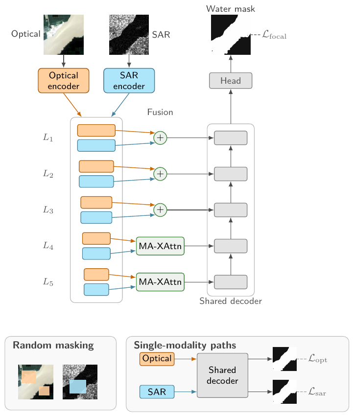
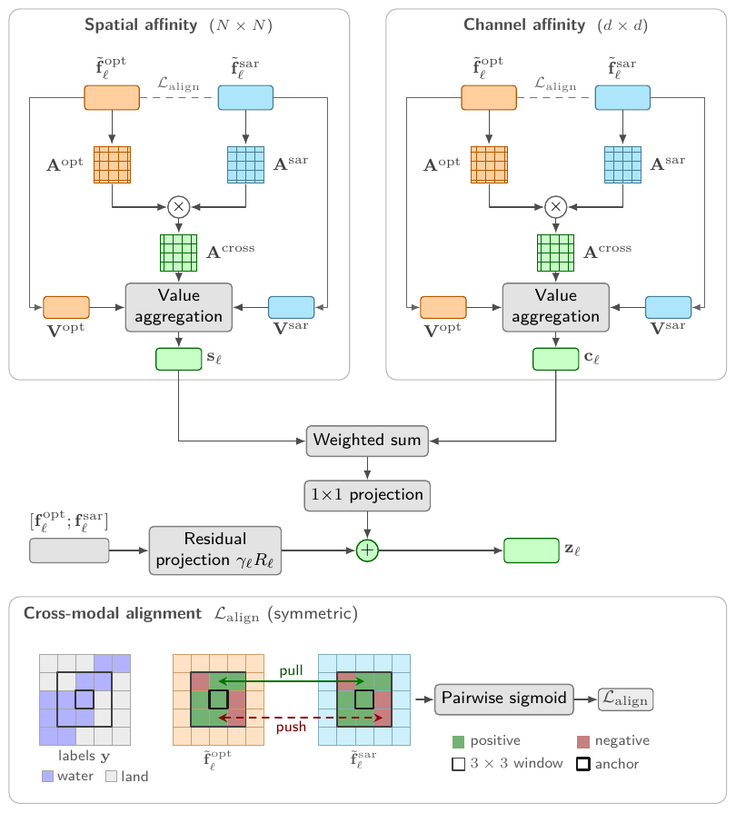
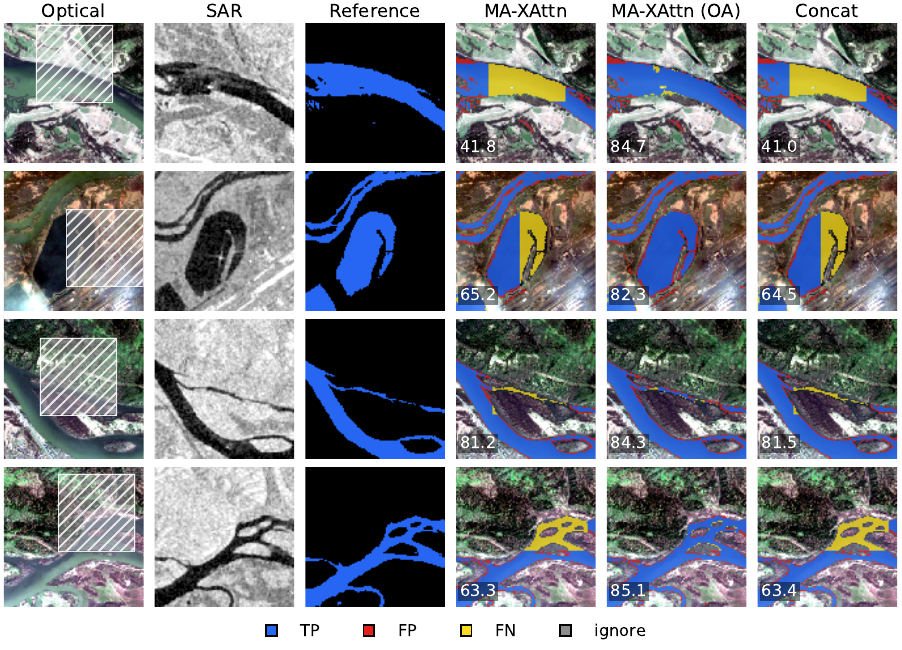

# SegFlood: Optical–SAR flood and surface-water mapping with MA-XAttn and occlusion-aware training

A PyTorch Lightning + Hydra codebase for dual-stream optical–SAR water segmentation. It contains the
**MA-XAttn** fusion block, an **occlusion-aware training recipe** that keeps a fusion model usable when one
sensor is missing or partly masked, and matched-protocol baselines (input concatenation, feature addition,
feature concatenation, bidirectional cross-attention, gated fusion) on five public benchmarks.

<p align="center">
  
</p>

Two modality-specific encoders produce feature pyramids; the two deepest levels are fused by MA-XAttn, the
shallower levels by addition, and a shared decoder predicts the water mask. During training the optical and SAR
inputs are randomly masked, and the shared decoder additionally reads each stream alone, so that a missing or
masked modality at inference is a situation the network has already seen.

## Highlights

- **Every dual-stream model trained on complete inputs breaks** when a modality is missing or partly masked:
  on S1S2-Water, Water IoU of the standard MA-XAttn model drops from 97.3 to 68.5 under a 30 % mask and to 0.4
  without the optical input; the five baselines behave the same way.
- **Occlusion-aware training removes these failures at identical inference cost**: 96.7 under the 30 % mask,
  83.8 without optical, 96.8 without SAR, with clean accuracy unchanged. The gain holds for untrained mask areas of
  10–70 % and is specific to masked-out (zero-filled) pixels.
- **MA-XAttn is an efficiency trade-off rather than an accuracy gain**: 97.30 ± 0.30 vs 97.28 ± 0.06 Water IoU for
  feature concatenation on S1S2-Water, at 55 % of the parameters and 36 % of the FLOPs.

<p align="center">
  
  &nbsp;&nbsp;
  
</p>

*Left: the MA-XAttn block — spatial and channel affinities computed within each modality and composed across
modalities. Right: S1S2-Water test tiles with 30 % of the optical image masked (hatched); standard-protocol models
lose the water inside the mask, the occlusion-aware model recovers it from SAR.*

## Results

Water IoU (%) on the test splits, ResNet-50 encoders, mean ± SD over three seeds. "Standard" = trained on
complete inputs; "OA" = occlusion-aware training. Full tables, other encoders (EfficientNet-B4, MobileNetV3,
DINOv3, SAM2) and the CAU-Flood / Kuro Siwo / WorldFloods v2 results are in the paper.

| Dataset | Model | Clean | 30 % optical mask | Optical missing | SAR missing | SAR noise |
|---|---|---|---|---|---|---|
| S1S2-Water | Feature concat (standard) | 97.28 ± 0.06 | 70.1 ± 2.6 | 8.0 ± 6.8 | 12.8 ± 1.7 | 97.2 ± 0.1 |
| S1S2-Water | MA-XAttn (standard) | 97.30 ± 0.30 | 68.5 ± 0.2 | 0.4 ± 0.7 | 49.8 ± 29.6 | 97.3 ± 0.3 |
| S1S2-Water | **MA-XAttn (OA)** | **97.36 ± 0.06** | **96.7 ± 0.2** | **83.8 ± 0.8** | **96.8 ± 0.5** | **97.4 ± 0.1** |
| GF-FloodNet | Feature concat (standard) | 97.16 ± 0.01 | 93.0 ± 4.3 | 10.9 ± 9.4 | 15.1 ± 4.2 | 94.7 ± 0.6 |
| GF-FloodNet | MA-XAttn (standard) | 96.87 ± 0.16 | 85.0 ± 17.0 | 16.5 ± 0.4 | 24.6 ± 13.7 | 95.4 ± 1.8 |
| GF-FloodNet | **MA-XAttn (OA)** | 96.82 ± 0.12 | **96.6 ± 0.2** | 73.2 ± 6.5 | **94.8 ± 0.1** | **96.4 ± 0.3** |

Per-seed values behind every number are listed in the Supplementary Material of the paper.

## Installation

```bash
git clone https://github.com/xiaojiayin/SegFlood.git
cd SegFlood
conda env create -f environment.yaml      # or: pip install -r requirements.txt
conda activate segflood
export PROJECT_ROOT="$(pwd)"
```

Encoder weights are downloaded through `timm` on first use.

## Data

| Dataset | Optical | SAR | Tiles (train / val / test) | Task |
|---|---|---|---|---|
| [GF-FloodNet](https://doi.org/10.1080/17538947.2023.2230978) | GF-2 B,G,R,NIR | GF-3 VV | 9,372 / 2,678 / 1,338 | Flood extent |
| [CAU-Flood](https://doi.org/10.1016/j.jag.2023.103197) | S-2 R,G,B,NIR (pre-event) | S-1 VV (post-event) | 13,328 / 1,903 / 3,071 | Flood change |
| [S1S2-Water](https://zenodo.org/records/11278238) | S-2 B,G,R,NIR | S-1 VV,VH | 68,644 / 14,783 / 14,394 | Permanent water |
| [Kuro Siwo](https://github.com/Orion-AI-Lab/KuroSiwo) | – | S-1 VV,VH | 21,273 / 5,031 / 13,630 | Water, SAR only |
| [WorldFloods v2](https://github.com/spaceml-org/ml4floods) | S-2 B,G,R,NIR | – | 65,582 / 3,524 / 4,703 | Flood, optical only |

Download each dataset from its original source and place it under `data/<Dataset>/`. GF-FloodNet, CAU-Flood, Kuro Siwo
and WorldFloods v2 are read in their public tile format; S1S2-Water is tiled with `scripts/data_pre/prepare_s1s2_water_tiles.py`.
Dataset roots can also be given as `data.root=...`.
CAU-Flood label 1 means *newly flooded* pixels (permanent water is background); GF-FloodNet label 1 means all water.

## Training

```bash
# MA-XAttn, ResNet-50 encoders, S1S2-Water, standard protocol
python src/train.py experiment=resnet50_resnet50_s1s2water seed=42

# baselines on the same encoders
python src/train.py experiment=resnet50_resnet50_s1s2water model.fusion.fusion_type=concat          # feature concat
python src/train.py experiment=resnet50_resnet50_s1s2water model.fusion.fusion_type=canonical_add   # feature add
python src/train.py experiment=resnet50_early_fusion_s1s2water                                      # input concat

# occlusion-aware training: random masking of either input + optical-only / SAR-only passes + alignment term, 50 epochs
python src/train.py experiment=resnet50_resnet50_s1s2water seed=42 trainer.min_epochs=50 \
  +model.pixel_optical_dropout_p=0.5 +model.pixel_sar_dropout_p=0.3 +model.pixel_optical_dropout_area=0.3 \
  +model.pixel_dropout_warmup_epochs=3 +model.pixel_dropout_ramp_epochs=5 \
  +model.sar_only_head_weight=0.5 +model.optical_only_head_weight=0.5 \
  model.alignment_enabled=true model.alignment_mode=semantic_local model.alignment_layers=[-1,-2] \
  model.alignment_target_weight=0.0005 model.alignment_temperature=0.12 model.alignment_patch_radius=1 \
  +model.alignment_in_image_only=true +model.alignment_exclude_boundaries=true +model.alignment_cap_mode=none \
  +model.alignment_semantic_stop_gradient=true +model.alignment_warmup_epochs=2 +model.alignment_independent_projection=false
# the same recipe without the alignment term (control): replace the alignment lines by model.alignment_enabled=false
```

Experiment configs for all encoder pairs and datasets are in `configs/experiment/`; the launchers that produced the
paper's runs, with their complete override strings, are in `scripts/run/jag_supplement/` (Slurm).

## Evaluation under degraded inputs

```bash
# clean
python src/eval.py experiment=resnet50_resnet50_s1s2water ckpt_path=<CKPT>
# one modality missing (single-modality path through the shared decoder)
python src/eval.py experiment=resnet50_resnet50_s1s2water ckpt_path=<CKPT> data.eval_modal_mode=sar_only
# square mask covering 30 % of the optical tile (zero fill); use test_degradation_fill for other constants
python src/eval.py experiment=resnet50_resnet50_s1s2water ckpt_path=<CKPT> \
  +model.test_degradation=optical_cloud +model.test_degradation_strength=0.3
# additive SAR noise
python src/eval.py experiment=resnet50_resnet50_s1s2water ckpt_path=<CKPT> \
  +model.test_degradation=sar_noise +model.test_degradation_strength=0.5
```

`scripts/run/jag_supplement/eval_robustness.sh` wraps these calls for Slurm; `profile_latency.py` and
`profile_aten_flops.py` measure latency, throughput and FLOPs.

## Repository layout

```
configs/         Hydra configs (data, model, trainer, experiment)
src/             training / evaluation entry points, datamodules, encoders, fusion blocks, decoder, losses
scripts/         Slurm launchers (run/), inference (infer/), dataset preparation (data_pre/)
tests/           unit tests
```

## Citation

The paper is under review; until it appears, please cite this repository (tag `v20260916`).

## Acknowledgements

Encoders and pretrained weights come from [`timm`](https://github.com/huggingface/pytorch-image-models); the
Hydra + Lightning project structure follows
[`lightning-hydra-template`](https://github.com/ashleve/lightning-hydra-template). Datasets remain under their
original licences.
