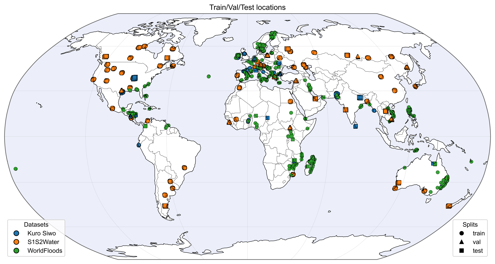
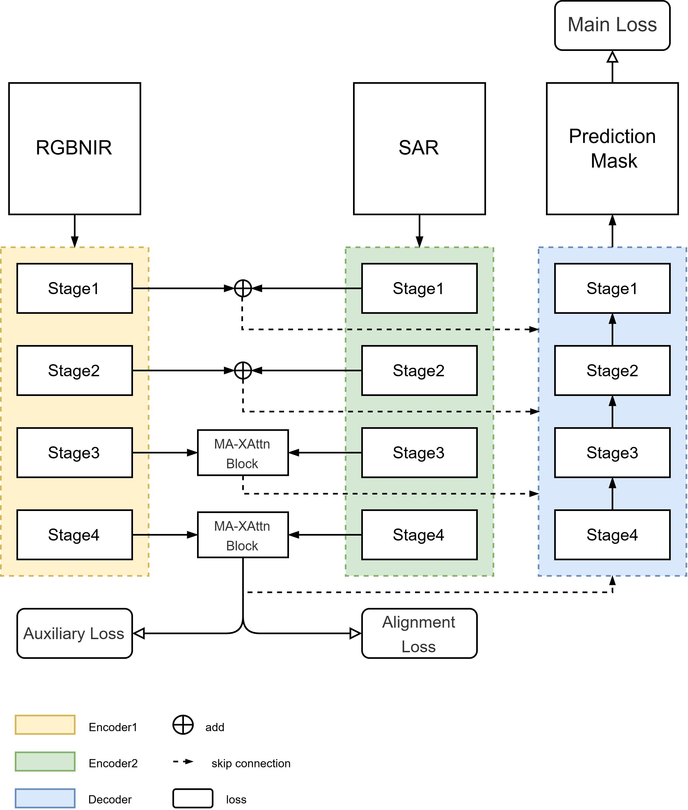
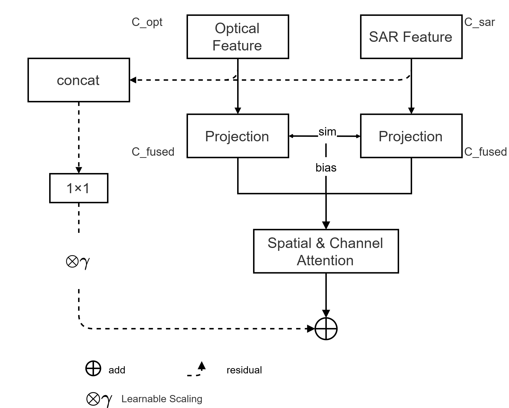
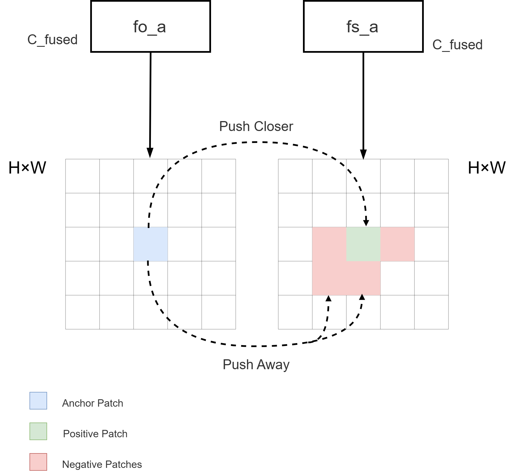

## MA-XAttn: A Unified Optical--SAR Benchmark and Fusion Framework for Flood and Surface-Water Mapping

> **中文文档**: [README_CN.md](README_CN.md)

SegFlood is a research codebase for multi-modal flood (or water) segmentation with a unified Hydra + PyTorch Lightning pipeline. It supports:

- Multi-modal inputs: **Optical** (e.g., RGB+NIR) + **SAR** (VV/VH)
- Single-modal baselines (optical-only or SAR-only)
- A lightweight fusion system (concat/add/MA-XAttn)
- Training, evaluation, and inference utilities (per-tile + mosaic export where applicable)

### Figures

#### (a) Dataset split locations



#### (b) Architecture overview

<table>
  <tr>
    <td style="vertical-align: top; width: 60%;">
      
    </td>
    <td style="vertical-align: top; width: 40%;">
      <br>
      
    </td>
  </tr>
</table>

## Repository layout

```text
configs/
  data/                  # per-dataset DataModule configs (gf_floodnet, cau_flood, ...)
  model/                 # model/encoder/fusion/decoder configs
  experiment/            # full experiment overrides
  trainer/               # Lightning Trainer configs
  callbacks/             # callback configs
  logger/                # logger configs
src/
  train.py               # main training entrypoint (Hydra)
  eval.py                # evaluation entrypoint (Hydra)
  data/
    datasets/            # torch.utils.data.Dataset implementations per dataset
    datamodules/         # Lightning DataModule implementations per dataset
  models/                # encoders/fusion/decoders + LightningModule
  infer/                 # prediction writers + dataset-specific inference utilities
  utils/                 # logging, instantiators, and other utilities
scripts/
  run/                   # SLURM training scripts (sbatch)
  infer/                 # SLURM inference scripts + thin python entrypoints
  data_pre/              # dataset pre-processing scripts
assets/                  # figures used in the README
```

## Quick start

### Environment setup

```bash
conda create -n segflood-test python=3.11 -y
conda activate segflood-test
pip install -U pip setuptools wheel
pip install -r requirements.txt
```

Notes:

- `requirements.txt` contains the Python dependencies required by this repo (training + inference).

### Run (local)

Hydra path resolution requires `PROJECT_ROOT`:

```bash
export PROJECT_ROOT="$(pwd)"
python src/train.py train=False test=False
```

### Run (SLURM / HPC)

This repo includes SLURM scripts under `scripts/run/` and `scripts/infer/`.

Example: run an experiment by name:

```bash
sbatch scripts/run/train_experiment.sh resnet50_resnet50_gffloodnet
```

Example: run GF-FloodNet inference (per-tile + metrics export):

```bash
sbatch scripts/infer/infer_gffloodnet.sh
```

## Datasets

All datasets are converted into **patch-based samples** for training and evaluation.

| Dataset        | Modalities                         |  Train |    Val |   Test | Task                                              |
| -------------- | ---------------------------------- | -----: | -----: | -----: | ------------------------------------------------- |
| GF-FloodNet    | GF-3 SAR (VV), GF-2 optical        |  9,372 |  2,678 |  1,338 | SAR--optical flood segmentation                   |
| CAU-Flood      | S2 optical (pre), S1 SAR (post)    | 13,328 |  1,903 |  3,071 | Optical--SAR flood change detection               |
| Kuro Siwo      | S1 GRD SAR, DEM                    | 21,273 |  5,031 | 13,630 | SAR-only water mapping                            |
| WorldFloods v2 | S2 L1C optical (BGRI)              | 65,582 |  3,524 |  4,703 | Optical-only flood and surface-water segmentation |
| S1S2-Water     | Coreg. S1 SAR + S2 optical (+ DEM) | 61,017 | 29,584 | 29,584 | Global permanent water segmentation               |

Minimal label semantics you must not mix up:

- **CAU-Flood**: change detection — label 1 means **newly flooded pixels** (permanent water is background).
- **GF-FloodNet**: segmentation — label 1 means **all water bodies** in the post-event imagery.

All dataset roots are configured via `data.root=...` (see `configs/data/*.yaml`).

Minimal conventions used in this repo:

- **All datasets are converted into patch-based samples** for training/evaluation.
- **Inputs**
  - Optical: RGB(+NIR) or Sentinel-2 band subsets
  - SAR: VV/VH (dataset-dependent)
  - Optional DEM is treated as an extra input channel (dataset-dependent)
- **Masks**
  - Binary tasks use labels \(\{0, 1\}\) with optional ignore index \(-1\) in some datasets.

## Experiments

Experiment configs live in `configs/experiment/*.yaml`.

- Run with:

```bash
python src/train.py experiment=<experiment_name>
```

- Or via SLURM wrapper:

```bash
sbatch scripts/run/train_experiment.sh <experiment_name>
```

Notes:

- `scripts/run/train_experiment.sh` infers the dataset key from the experiment name
  (`cauflood | gffloodnet | s1s2water | kurosiwo | worldfloodsv2`) and sets `data.root` accordingly.

## Fusion and alignment

Fusion is implemented via `src/models/fusion/FeatureFusion` and supports:

- `concat` (channel concatenation)
- `add`
- `xattn` (MA-XAttn)

Alignment regularization:

- Train-only SigLIP-style PatchNCE alignment regularization is implemented in `src/models/lightning_module.py`.
- When enabled, alignment is computed on selected feature levels and added as a regularizer to the main loss.

## Inference outputs

All inference entrypoints under `scripts/infer/*.py` run via `Trainer.predict` with a dataset-specific writer. Typical outputs:

- `predictions/` (GeoTIFF and/or PNG depending on dataset)
- `overall_metrics.xlsx`
- `detailed_samples.xlsx`

## Acknowledgements

- This repo is built upon and refactors components from the `timm` project: <https://github.com/huggingface/pytorch-image-models/>.
- The training pipeline structure and Hydra configuration patterns were adapted from `lightning-hydra-template`: <https://github.com/ashleve/lightning-hydra-template/>.
